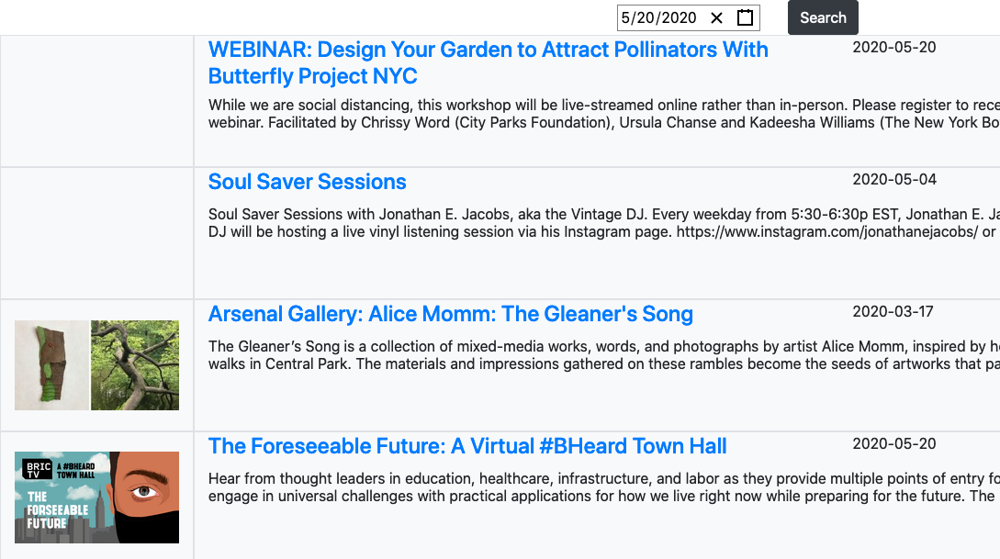

# Freedom
Local free events in New York City. 

Built with AWS Amplify & AppSync. Uses ElasticSearch, DynamoDB, NodeJS, React, and the Google Maps API.

Initially started because I was (am) a broke sucker in NYC. Currently, the events are collected by yours truly, from scrapers I wrote [here](https://github.com/elliott-king/freedom-scripts). This site can be found [here](https://freedom.cannibaltaylor.com/).

Since Coronavirus, I have pivoted to online free streaming events. All events are still currently NYC-focused. Once we return to a semblance of normal, I will bring back the map search functionality.

## Status
#### Events by location & date
MVP - done, now on hold

#### Streaming events by date
MVP - done, now main branch

## To Run
This is mostly a reminder for myself. Anyone else reading this may have difficulty setting up.

First you need to get a Google Maps API key. (The ones in `package.json` will only work for my machine). Then `amplify init` and all that [jazz](https://docs.amplify.aws/cli/start/install). It can be run with `npm run-script start`. You will need to use the [scrapers](https://github.com/elliott-king/freedom-scripts) to populate the backend.

## Todos

### Goals for alpha and beta testing:
| Goal                          | Tag          | Priority | In Progress |                Done |
| ----------------------------- | ------------ | :------: | ----------: | ------------------: |
| React Components              | qol, js      |   low    |             |                     |
| Filter public art by class    | js           |   med    |         yes | unnecessary for MVP |
| Flag public art               | graphql, js  |   high   |        done |                 MVP |
| Get photos & show info window | graphql, js  |   high   |         yes |                 MVP |
| Upload new location           | graphql, js  |   high   |         yes |                     |
| UI & QOL improvements         | qol, css, js |   low    |             |                     |
| Login process                 | UX           |  medium  |             |                     |
| Long-term support             |              |  medium  |             |                     |

| React/Components                                                                | Status         |
| ------------------------------------------------------------------------------- | -------------- |
| Have info window content be component that then contains form                   | done           |
| Forms should handle changes in multiple inputs with one method                  |                |
| Info window should be contained w/in google map screen (negates need to scroll) | done (sidebar) |
| Currently queries a location and fills the sidebar in one function (separate)   |                |

| Filter public art by class                                        | Status | Priority |
| ----------------------------------------------------------------- | ------ | -------- |
| Add options                                                       | done   | medium   |
| Ability to select multiple options                                |        | lowest   |
| Store types as list in dynamoDB (currently only one type allowed) |        | low      |
| Make types an enum in Appsync GraphQL API                         | done   |          |
| Check 'type' is chosen by user when uploading new location        | done   | low      |

| Free events                                                   | Status            | Priority |
| ------------------------------------------------------------- | ----------------- | -------- |
| Initial creation                                              | done              |          |
| Searchable in app                                             |                   |          |
| Accept new picture upload                                     |                   |          |
| Accept report/flagging                                        |                   |          |
| Search button should switch between public art and events     | done              | HIGH     |
| Filter search by date/time                                    | EVENT - time only | HIGH     |
| Do you need to sign up ahead of time? For Carnegie Hall, yes  |                   |          |
| Type checker on upload (python)                               |                   |          |
| Dates should be a discrete list (instead of start/end)        | done              | HIGH     |
| If searching for current day, ignore events with time < now   |                   | mid-high |
| Display event description                                     | done              | high     |
| Event calendar should open on date from search                | done              | medium   |
| Consider splitting 'art' into 'fine art' and 'arts & crafts'  |                   | low      |
| In schema: unify event and art with inherited 'location' type |                   | low      |
| Flag events                                                   | done              | mid-high |
| Option for all-day events & multiple days                     |                   | mid      |

| Flag public art/event                                                   | Status |
| ----------------------------------------------------------------------- | ------ |
| Seperate DynamoDB table                                                 | done   |
| Authentication for users                                                | done   |
| Store with location ID instead of just art name                         | done   |
| Show error when user does not select reason (currently only in console) | done   |

| Get photos & Info Window                                                      | Status                        |
| ----------------------------------------------------------------------------- | ----------------------------- |
| Download from DB                                                              | done                          |
| Close old info window when a new one is opened                                | done                          |
| Upload resized photos to db (400 x 400?)                                      | done - max dimension of 250px |
| Enforce Google Places API from app/site only - key has no restrictions        |                               |
| Error if photo doesn't exist: info window does not open                       | done (?)                      |
| throttles many requests: photo should only be rendered if infoWindow is shown | done (?)                      |
| leave googleusercontent & store photos from google on S3 (being throttled)    | done                          |
| search should ignore non-permenent locations that are out of date             | done                          |
| search type should be enum                                                    | done                          |
| ES console - Invalid host header requests?                                    |                               |

| Upload new Location (and photo)                                               | Status             |
| ----------------------------------------------------------------------------- | ------------------ |
| Upload to DB                                                                  | done               |
| Upload photos from app (mobile app only?)                                     | URGENT             |
| Should suggest user's current location                                        | done               |
| Each upload submission creates duplicate empty divs (bugfix)                  | low priority       |
| Upload new image should also add link in DynamoDB image list                  | done               |
| Only create new upload div if the old one does not exist (bugfix)             | done               |
| Upload to ES after dynamodb                                                   | done - @searchable |
| PublicArt in DynamoDb should have version to [prevent double writes][0]       |                    |
| Should image list be list of 'AWSURL' AppSync type?                           | done               |
| If 'close' button clicked, then sidebar reopened, image should remain         | done               |
| If any part of image upload fails, entire thing should fail                   |                    |
| Remove pin after upload                                                       | done               |
| Make most graphql fields mandatory                                            | done               |
| Unauthenticated, rejected uploads should notify the user why they have failed | URGENT             |
| Image upload should include which user uploaded it                            | REQ for MVP        |
| Image upload should take url OR image from disk                               | URGENT             |
| Upon successful upload, should clear sidebar                                  | done               |
| Image upload should take jpg                                                  | done               |

| UI & QOL improvements                                                  | Status                     |
| ---------------------------------------------------------------------- | -------------------------- |
| Resize image window to a standard size                                 | done                       |
| Place 'Report location' in own div                                     |                            |
| Main dropdown menu size more consistent                                |                            |
| All code to call AWS client should be in one file (-_-)                | done                       |
| Change name "flag form" -> "report form"                               | MVP - unchanged in graphql |
| Fix problem with 'amplify publish'                                     | using Amplify console      |
| Google uses 'lng', ES uses 'lon' -> inconsistent                       |                            |
| Revert aws-appsync package to official npm                             | done                       |
| Revert to default network fetch policy (currently always fetches)      |                            |
| Make PublicArt schema @searchable (will then automatically push to ES) | in progress                |
| Put Data Sources into api/CustomResources.json for eternal use         | mostly pre-generated       |
| Consider making sidebar collapsible                                    | done                       |
| Collapsing sidebar should not move center of map                       |                            |
| Host on a readable url                                                 | done                       |
| Bottom button should not truncate text                                 | done                       |
| Make sure all requests/queries have error catching                     | done                       |
| Fix 'cannot get /with-sidebar' bug                                     |                            |
| Speed up/streamline map load                                           | HIGH PRIORITY              |
| Improve date/calendar css                                              | med/high                   |
| Make mobile-responsive                                                 | med/high                   |

| Login Process (currently run by AWS)                         | Status        |
| ------------------------------------------------------------ | ------------- |
| User should only have to login to upload new image           | done          |
| Sign up should not care about phone number                   |               |
| Sign up should show error messages (not just console.log it) | HIGH PRIORITY |
| Log in should be self contained (not in art upload div)      | done          |

| Scraping/parsing                                                                            | Status | Priority |
| ------------------------------------------------------------------------------------------- | ------ | -------- |
| All titles should be capitalized                                                            | done   |          |
| Typecheck entries                                                                           |        | med      |
| Check existence of all necessary fields                                                     | done   |          |
| Maybe just regex all paren & take last one? (instead of looking for paren in last sentence) | done   |          |
| Event type should be a list & take multiple options                                         | done   |          |
| Should be able to split single event into multiple different                                |        | low      |
| Should be able to reject creation of event                                                  | done   |          |
| Add date range type as seperate type (2-d list? or list of 2-d lists?)                      |        | med-high |
| Consider splitting 'source' into title & url object?                                        |        | low      |

| Long-term Support                                  | Status | Priority              |
| -------------------------------------------------- | ------ | --------------------- |
| Backup data - 3 formats, 3 locations               |        | immediately after MVP |
| Create amplify 'dev' env w/ seperate ES & DynamoDB |        | immediately after MVP |
| Unit tests                                         |        | Immediately after MVP |
| Make history API usage more elegant                |        | mid/low               |

| non-code                  | Status |
| ------------------------- | ------ |
| Create some user journeys |        |

[0]: https://docs.aws.amazon.com/appsync/latest/devguide/tutorial-dynamodb-resolvers.html#modifying-the-updatepost-resolver-dynamodb-updateitem

### Possible extensions
- Use AWS Rekognition to reject images that do not meet decency guidelines
- Use Auth to credit images (like Google does)